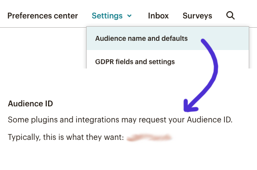
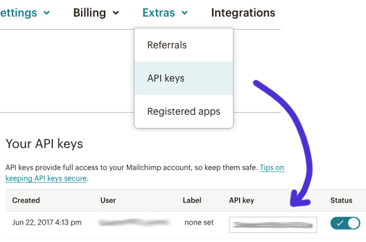
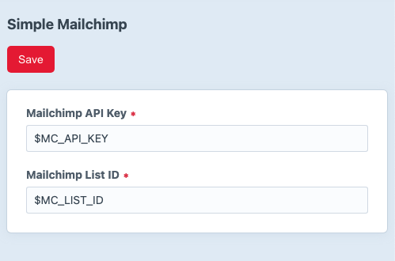

Simple Mailchimp plugin for Craft 4
===

A minimal Craft 4 plugin to connect forms to Mailchimp

## Installation

```bash
composer require leowebguy/simple-mailchimp
```

On your Control Panel, go to Settings → Plugins → "Simple Mailchimp" → Install

## Credentials

Gather the necessary info from Mailchimp

#### API Key _MC_API_KEY_

Go to https://admin.mailchimp.com/lists > Select Audience > Settings > Audience name and defaults > Audience ID



#### Audience ID _MC_LIST_ID_

Go to https://admin.mailchimp.com/account/api/ > API Key



Add the credentials to plugin settings



You may also use `.env` parameters like in the example above.

```dotenv
# Mailchimp
MC_API_KEY=xxx12345x1234x123xxx123xxxxx123xx-us14
MC_LIST_ID=xxx1234xx1234
```

## Usage

Your newsletter form template can look something like this:

```html
<form method="post">
    {{ csrfInput() }}
    <input type="hidden" name="tags" value="Tag_1,Tag_2">{# comma separated #}
    <input type="text" name="name">
    <input type="email" name="email">
    <button type="submit">Submit</button>
    <span class="notification" style="display: none"></span>
</form>
```

_The only required field is `email`. Everything else is optional._

You can use jQuery/Ajax to call plugin controller like the example below

```js
(function($) {
    $('form').submit(function(e) {
        e.preventDefault();
        $.post({
            url: '/mailchimp/send',
            data: $(this).serialize(),
            success: (r) => {
                if (r.success == true) {
                    $('.notification')
                        .text(r.msg)
                        .fadeIn()
                        .delay(6000).fadeOut();
                    $(this).trigger("reset");
                    // console.log(`%ccontact_id: ${r.id}`, 'color:#2c8');
                } else {
                    $('.notification')
                        .text(r.msg)
                        .fadeIn()
                        .delay(6000).fadeOut();
                }
            }
        });
    });
})(jQuery);
```

_Add jQuery to the template if necessary_

```html

```
